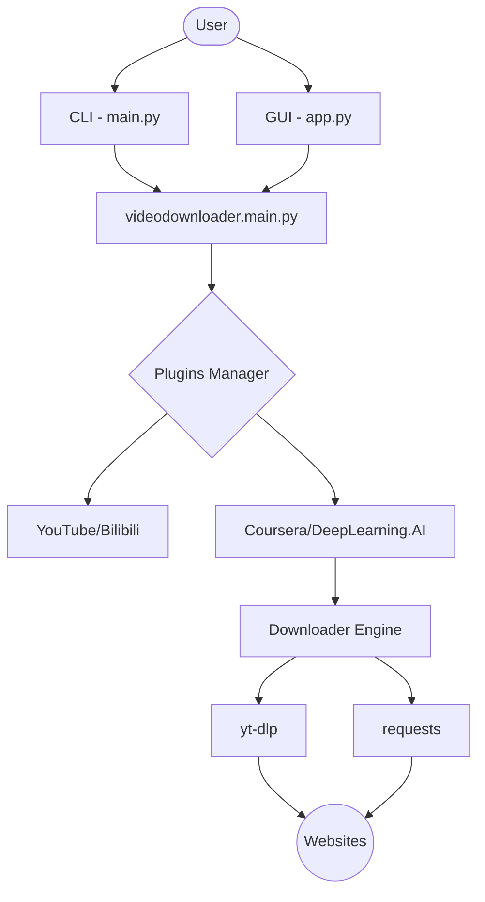

# 🏗️ Architecture Design

VideoDownloader follows a modular, plugin-based architecture designed for extensibility and robustness.

## High-Level Overview

The system is divided into three main layers:

1.  **Frontend Layer**:
    *   **CLI (`vd`)**: The primary command-line interface, powered by `argparse`.
    *   **GUI (`vd-gui`)**: A modern dark-themed graphical interface built with `CustomTkinter`. Both share the same underlying core logic.
2.  **Plugin Layer**:
    *   Implements the `BasePlugin` abstract class.
    *   Handles platform-specific logic: URL parsing, metadata extraction, and task generation.
3.  **Core Engine**:
    *   **`downloader.py`**: A wrapper around `yt-dlp` and `requests`. Handles concurrency, retries, and progress tracking.
    *   **`cookies.py`**: Manages authentication by extracting cookies from browsers (Chrome, Edge, etc.) or Netscape `cookies.txt` files.
    *   **`utils.py`**: Common utilities (WSL detection, logging setup).

## Component Interaction

## Core Abstractions

### `DownloadTask`
The `DownloadTask` object encapsulates everything needed for a single file download:
*   `url`: The direct or source URL.
*   `filename`: Target filesystem path.
*   `extra_opts`: Specific `yt-dlp` parameters.
*   `headers`: Authentication and browser emulation headers.

### `BasePlugin`
See [Platform Plugin Guide](plugins.md) for more details on the plugin system.
